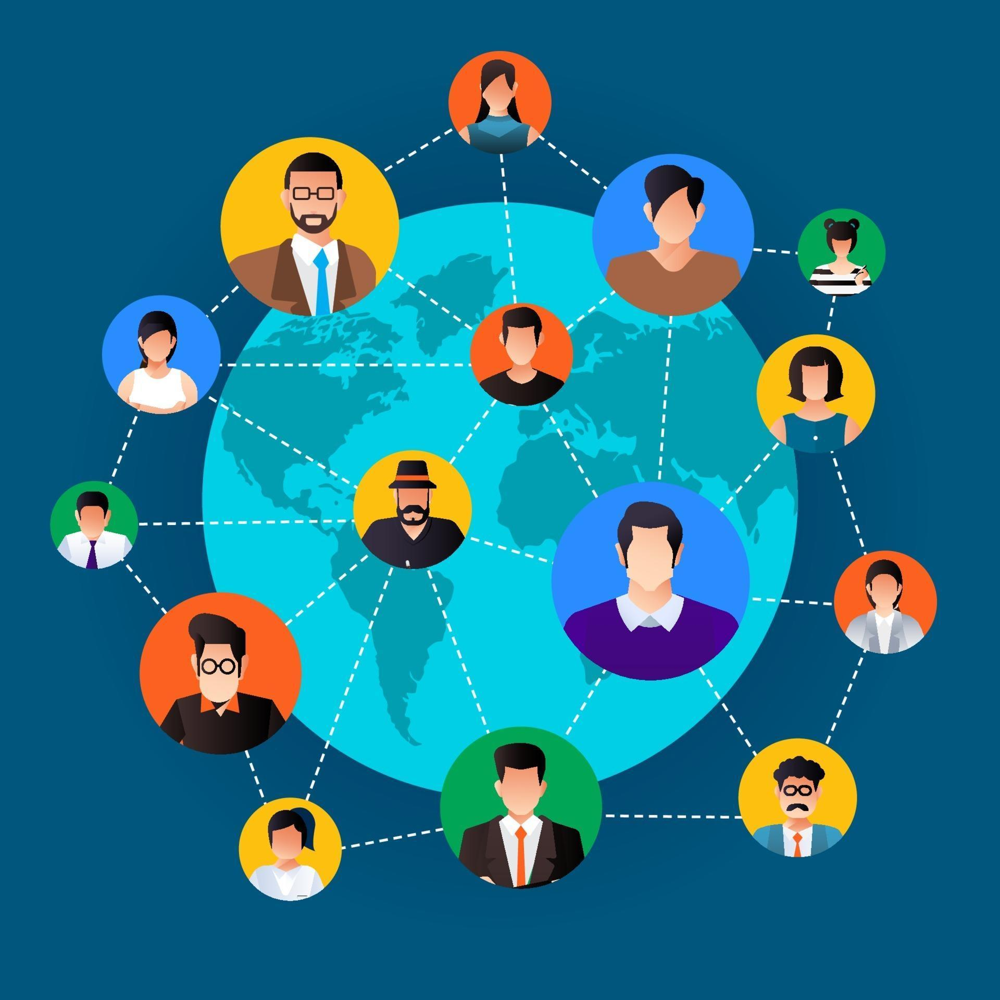

# Social Networking Sites

## Team:
1. Ivan Kopyna / KopynaIvan: 4, 5
2. Andrei Andreichenko / ShrewdLuni: 2, 3
3. Andrzej Kłosowicz / Wykor: 1, 6

## INTRODUCTION

Social networking sites have transformed the way people communicate and interact with one another. In the past, social interaction was often limited to face-to-face meetings or phone calls. However, with the rise of platforms like Facebook and Twitter, individuals can now connect with friends and family across the globe in an instant. This shift has not only changed personal relationships but has also impacted how businesses engage with their customers and promote their brands.

The evolution of social networking sites has been rapid, with new platforms emerging to cater to various user needs and preferences. For instance, Instagram focuses on visual content sharing, while LinkedIn serves as a professional networking tool. Each platform offers unique features that appeal to specific demographics, allowing users to express themselves in ways that align with their interests and lifestyles. This diversity in social media caters to a wide range of audiences, making online engagement a staple of modern life.

Furthermore, the influence of social networking sites extends beyond personal connections to societal and political realms. They serve as platforms for activism, awareness campaigns, and the dissemination of information. Events such as the Arab Spring and movements like Black Lives Matter have harnessed the power of social media to mobilize support and spark change. As these platforms continue to evolve, their impact on society will only grow, highlighting the importance of understanding their role in our daily lives.

## DATA

The table below summarizes key data about some popular social networking sites. It includes their launch year, monthly active users, and primary purpose.

| Platform   | Launch Year | Monthly Active Users (Millions) | Primary Purpose               |
|------------|-------------|----------------------------------|-------------------------------|
| Facebook   | 2004        | 2900                             | Social Networking             |
| Instagram  | 2010        | 1400                             | Photo and Video Sharing       |
| LinkedIn   | 2003        | 900                              | Professional Networking       |

## IMAGES

Here are some images related to social networking sites:

1. 
2. 
3. 
